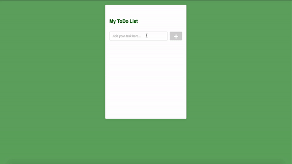

# To_Do_List

An apache netbeans project of web to-do list with servlet.

## Create Database
You should create your own database in Apache Netbeans.

Example used in the code:
```
Database Name:  todolist
User Name:  test
Password: test
```
After the database is created, connect the database and run *Tasks.sql*.

## Layout

